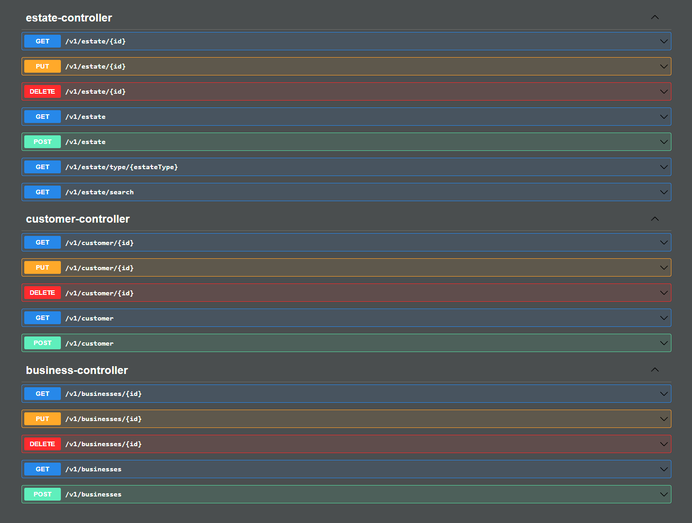
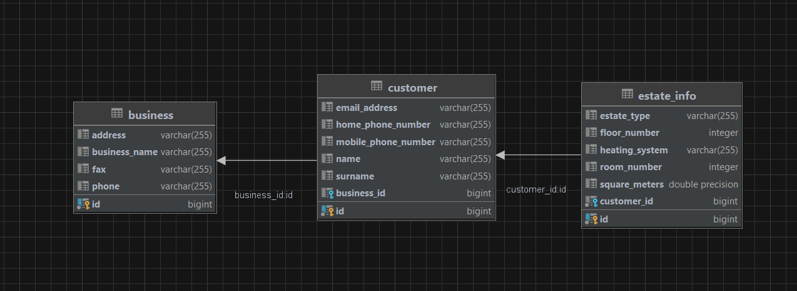
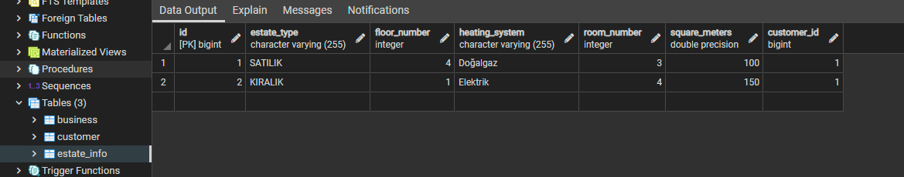
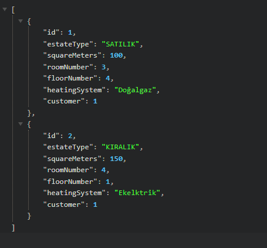
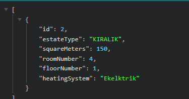

# Real Estate App
## Teknolojiler

- Java 17
- Spring Boot
- PostgreSQL
- Spring Data JPA
- OpenApi


## Backend Uygulaması için;
[Buraya](https://github.com/Mduzgunn/real-estate) tıklayarak projeyi githubdan indirebilirsiniz.

Projeyi klonlayın
```bash
  git clone https://github.com/Mduzgunn/real-estate.git
```

Proje dizinine gidin
```bash
  cd real-estate
```

Gerekli paketleri yükleyin
```bash
  mvn clean install
```

Projeyi çalıştırın
```bash
  mvn spring-boot:run
```

## Kullanım
http://localhost:8080/swagger url'inden swagger'a ulaşabilirsiniz.


Uml


Veriler alınırken eğer bir hata ile karşılaşılmamışsa görseldeki gibi PostgreSQL'de oluşturduğumuz db'ye kaydedilecektir.



## Senaryo
estate eklemesi yapıyoruz



sonrasında "http://localhost:8080/v1/estate/search?squareMeters=150&floorNumber=1" url'inden 'squareMeters' ve 'floorNumber' parametrelerini kullanarak arama yapıyoruz.




Bu parametreleri swagger kullanarak kolaylıkla ayarlayabilirsiniz.
- estateType
- squareMeters
- roomNumber
- floorNumber
- heatingSystem 

parametrelerinden istediklerinizi kullanarak arama yapabilirsiniz.


